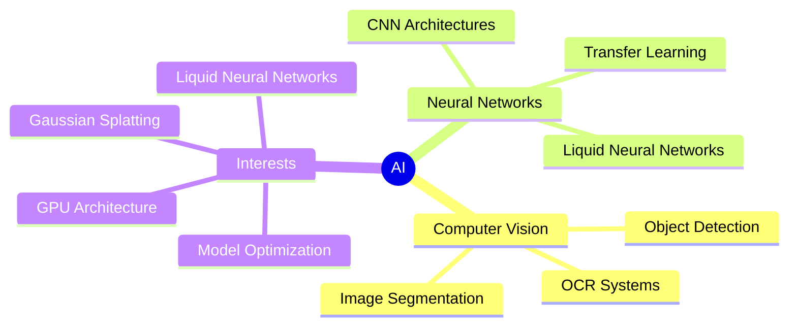

<div align="center">
  <h1>🤖 Jai Singh Rathore</h1>
  <h3>AI/ML Engineer | Game Developer</h3>
  
  [](https://www.linkedin.com/in/jai-singh-rathore-350993280)
  [](https://discordapp.com/users/jaizxzx)
  
</div>


### 🔮 AI Journey 



---

## 🧠 **Skills**

<table>
  <tr>
    <td align="center"></td>
    <td align="center"></td>
    <td align="center"></td>
    <td align="center"></td>
    <td align="center"></td>
  </tr>
  <tr>
    <td align="center"></td>
    <td align="center"></td>
    <td align="center"></td>
    <td align="center"></td>
    <td align="center"></td>
  </tr>
  <tr>
    <td align="center"></td>
    <td align="center"></td>
    <td align="center"></td>
    <td align="center"></td>
    <td align="center"></td>
  </tr>
  <tr>
    <td align="center"></td>
    <td align="center"></td>
    <td></td>
    <td></td>
    <td></td>
  </tr>
</table>

---
<h2 align="center">👨‍💻 Contribution Graph</h2>

<p align="center"> 
  
</p>

<div align="center">
  
---

### 🤝 Let's Collaborate!
```python
def contact_me():
    email = "jaisinghrathore4432@gmail.com"
    interests = ["AI Research", "Computer Vision", "Deep Learning"]
    available_for = ["Research Collaboration", "AI Projects", "Technical Discussions"]
    return "Let's build the future of AI together!"
```

  
*"The real danger is not that computers will begin to think like humans, but that humans will begin to think like computers."* - Sydney J. Harris
</div>

---
